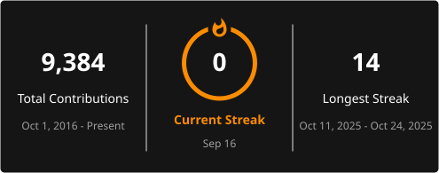

# Hi, I'm Asim Butt 👋

### Senior Laravel / PHP Developer

Backend Engineering • AWS • Databases • Distributed Systems • Performance & Scalability

I build and optimize production-grade Laravel applications with a strong focus on **performance, scalability, reliability, database efficiency, and maintainable architecture**.

My work primarily involves Laravel/PHP systems running on AWS, high-volume MySQL/Aurora workloads, asynchronous processing with queues, caching, API performance, CI/CD, and production debugging.

---

## 👨‍💻 About Me

- Senior **Laravel / PHP** developer focused on backend and platform engineering
- Building production workloads on **AWS** using Laravel Vapor, Lambda, and SQS
- Working extensively with **MySQL / Aurora**, query optimization, indexing, and high-volume data processing
- Designing reliable asynchronous workflows using **queues, retries, locking, and concurrency control**
- Using **Redis / Valkey** for caching, distributed locks, and application performance
- Focused on profiling, debugging, and eliminating **N+1 queries, slow SQL, memory bottlenecks, and inefficient processing**
- Building and maintaining automated **CI/CD, testing, and code-quality workflows**
- Exploring AI-assisted development workflows to improve engineering productivity and software quality

---

## 🎯 Core Expertise

### Backend Engineering

`Laravel` `PHP` `REST APIs` `Eloquent` `Queue Processing` `Event-Driven Systems`

### Database & Performance

`MySQL` `Aurora MySQL` `Query Optimization` `Indexing` `Large Datasets` `Performance Profiling`

### Cloud & Distributed Systems

`AWS` `Laravel Vapor` `Lambda` `SQS` `Redis` `Valkey` `Docker`

### Testing & Engineering Quality

`Pest` `PHPUnit` `SonarCloud` `CI/CD` `Xdebug` `Static Analysis`

### Frontend

`Vue.js` `JavaScript` `Vite` `Tailwind CSS`

---

## 🛠️ Tech Stack

### Backend

### Database & Cache

### AWS & Infrastructure

### Frontend

### Engineering Tools

---

## ⚙️ Engineering Focus

### Performance Engineering

Profiling Laravel applications, optimizing database access, reducing N+1 queries, improving memory usage, and eliminating high-latency processing paths.

### Database Engineering

Working with high-volume MySQL/Aurora datasets, indexing strategies, batch processing, data archiving, and query-plan optimization.

### Distributed Processing

Building reliable queue-based workflows with SQS, retries, idempotency, distributed locking, concurrency control, and failure recovery.

### Cloud Architecture

Running production Laravel workloads using AWS Lambda, Laravel Vapor, SQS, Redis/Valkey, and serverless infrastructure.

### Engineering Quality

Automated testing, CI/CD, static analysis, SonarCloud, production debugging, and maintainable application architecture.

---

## 📊 GitHub Activity

  
  

  

---

## 🤝 Connect

---

  

